# Tutorial - Lumen Privacy Monitor

## 1. Apresentação
Este documento é um tutorial para a instalação e utilização do aplicativo Lumen Privacy Monitor. 

O Lumen Privacy Monitor é um App Android que analisa o tráfego de dados e identifica possíveis vazamentos realizado pelos apps instalados em seu celular. Ele é um produto principal do projeto [The Haystack Project ](https://www.haystack.mobi/). 

## 2. Instalação

O app está disponível na [Play Store](https://play.google.com/store/apps/details?id=edu.berkeley.icsi.haystack&hl=pt_BR).

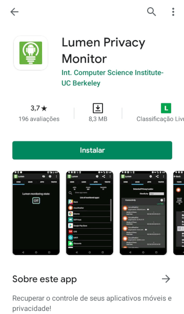

## 3. Conhecendo o App

Na primeira execução, o Lumen irá solicitar um conjunto de permissão:

<table>
  <tr>
    <td>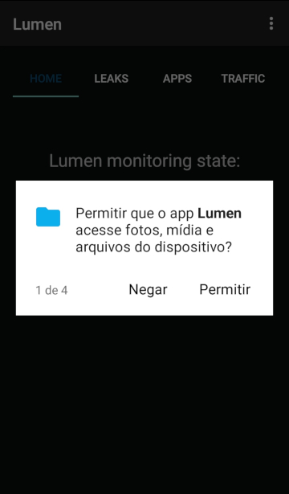</td>
    <td>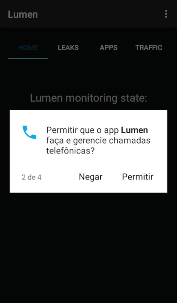</td>
    <td>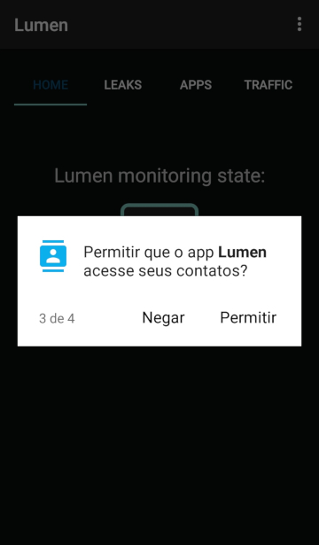</td>
    <td>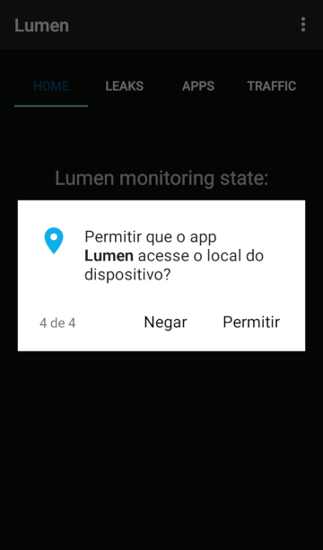</td>
  </tr>
</table>

Após esta etapa, você terá acesso ao app. Ele possui quatro abas:

### 3.1. Aba Home

Nesta aba você habilita/desabilita a funcionalidade de monitoramento do app:

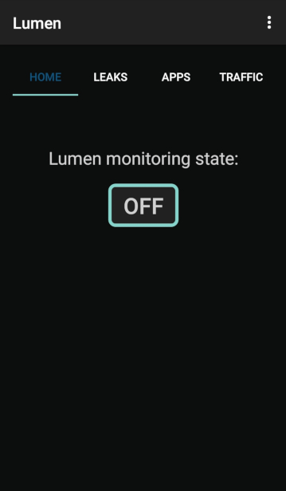

### 3.2. Aba Leaks

Nesta aba você visualiza possíveis vazamentos de dados: 

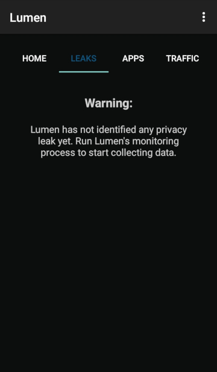

### 3.2. Aba Apps

Nesta aba será carregada uma lista com todos os apps que foram monitorados pelo Lumen:

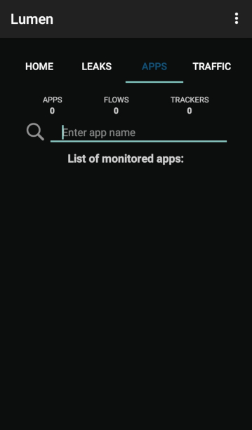

### 3.2. Aba Traffic

Nesta aba você visualiza informações sobre o tráfego de dados realizado pelos apps monitorados:

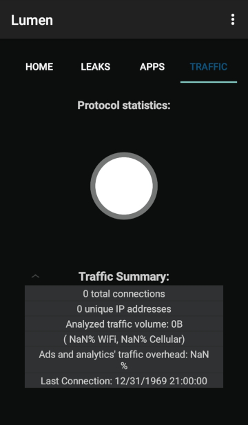

## 4. Utilização

Para começar a utilizar o app, você deve ir a <b>Aba Home</b> e habilitar o monitoramento de apps:

<table>
  <tr>
    <td></td>
    <td>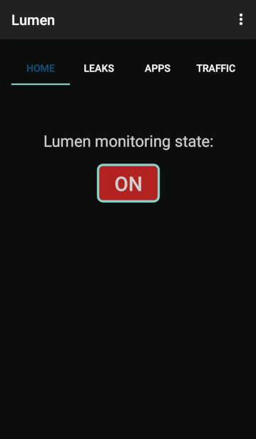</td>
  </tr>
</table>

Você irá notar que um ícone de uma pequena chave irá aparecer na área superior de notificação de seu celular. Esse ícone indica que o monitoramento está em execução.

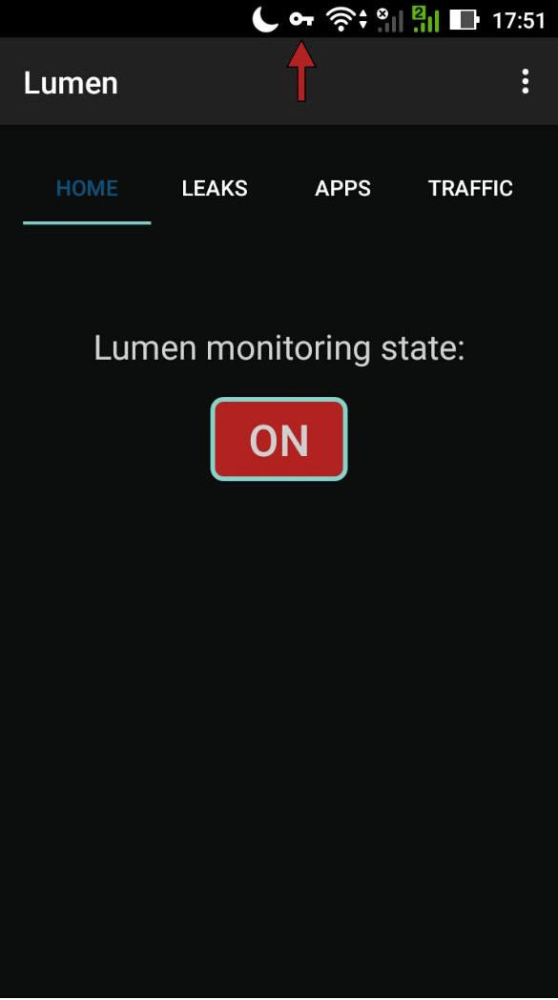

A próxima etapa é utilizar o(s) app(s) que deseja monitorar. Após esta utilização, retorne ao Lumen Monitor e verifique a <b>Aba Apps</b>. O(s) app(s) que você utilizou e/ou que estão em execução em seu dispositivo aparecerão listados:

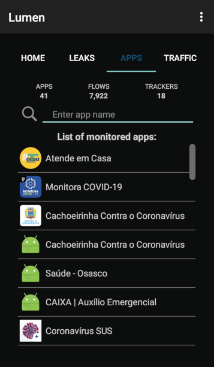

A partir deste ponto você pode realizar uma análise geral de todos os apps monitorados ou uma análise particular de um app específico. Para ter acesso à análise geral, basta clicar nas <b>Abas Leaks</b> e <b>Traffic</b> para visualizar possíveis vazamentos e informações sobre o tráfego de dados:

<table>
  <tr>
    <td>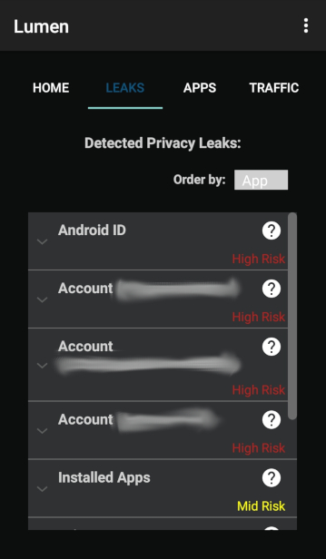</td>
    <td>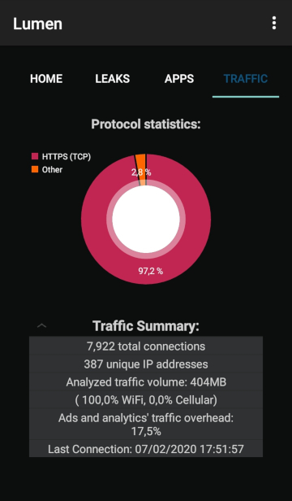</td>
  </tr>
</table>

Para uma análise específica, selecione o app de seu interesse na <b>Aba Apps</b> e em seguida visualize informações específicas sobre ele nas abas <b>Flows</b>, <b>Leaks</b>, <b>Traffic</b> e <b>More</b>:

<table>
  <tr>
    <td>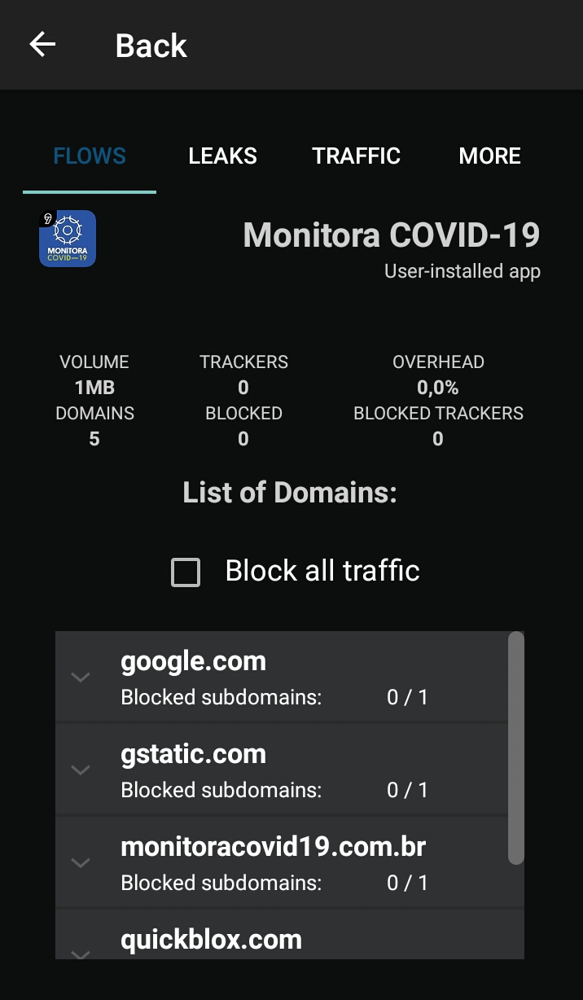</td>
    <td>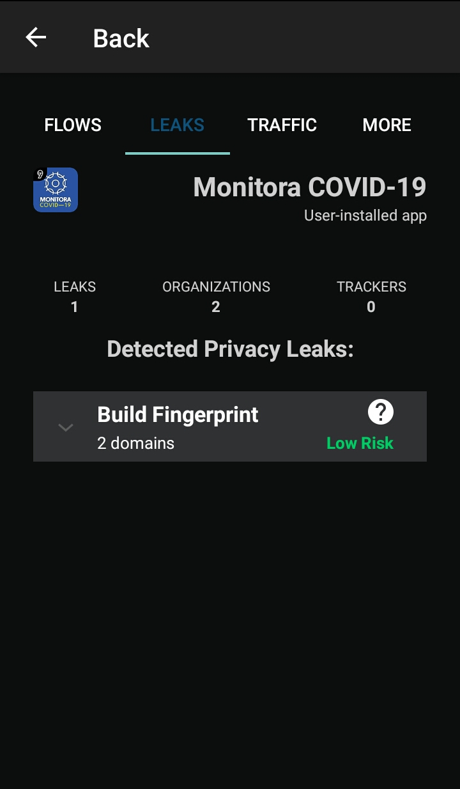</td>
    <td>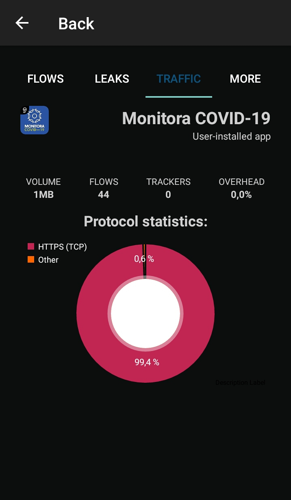</td>
    <td>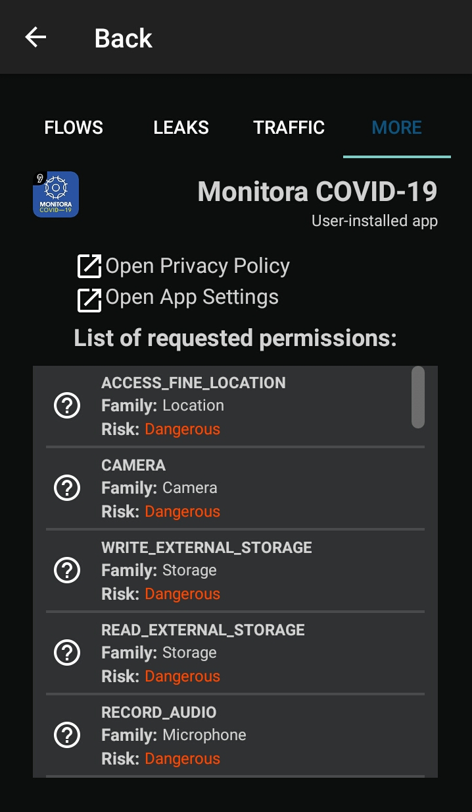</td>
  </tr>
</table>

